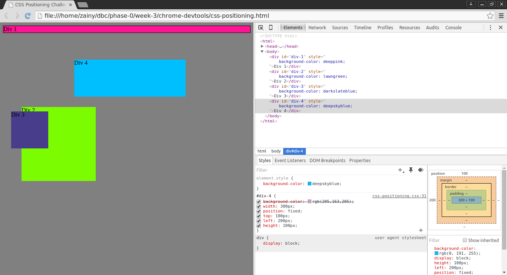
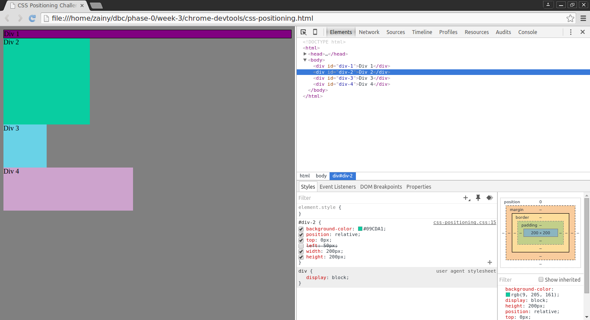
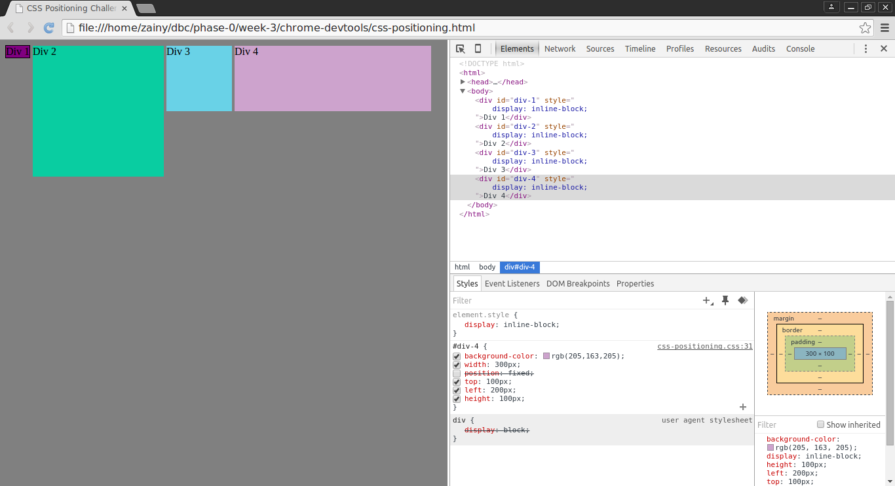
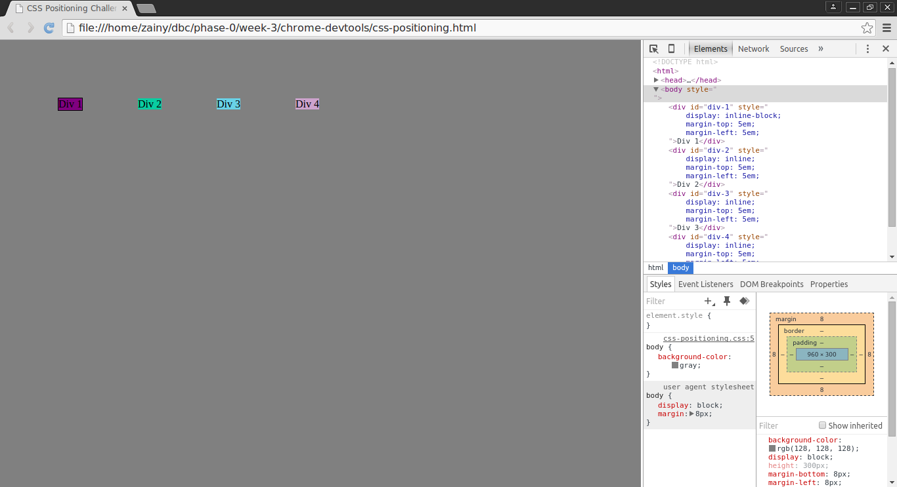
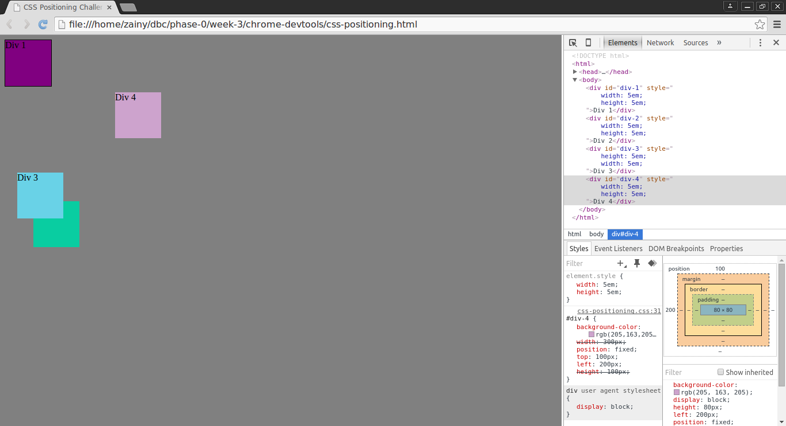
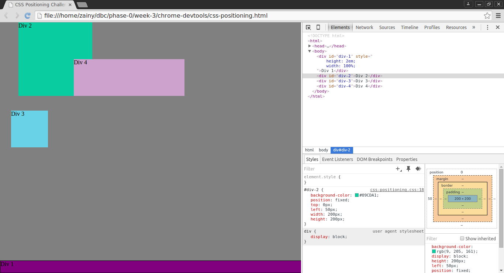
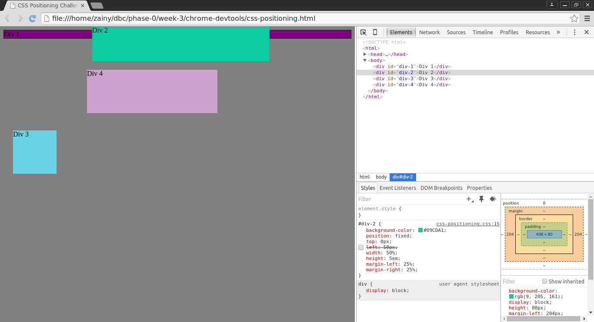
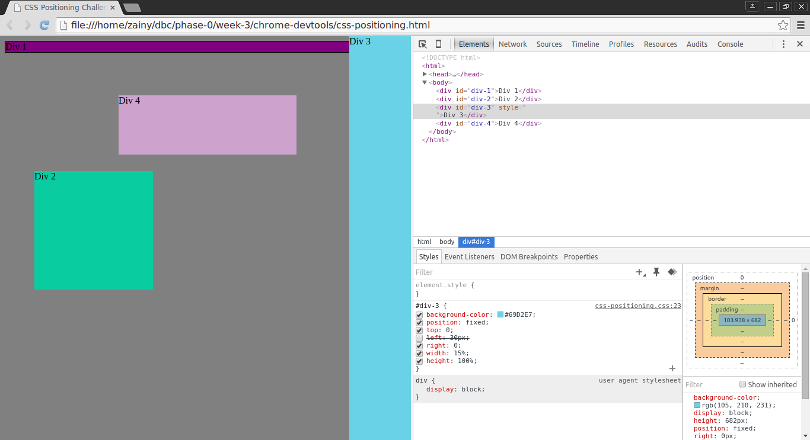
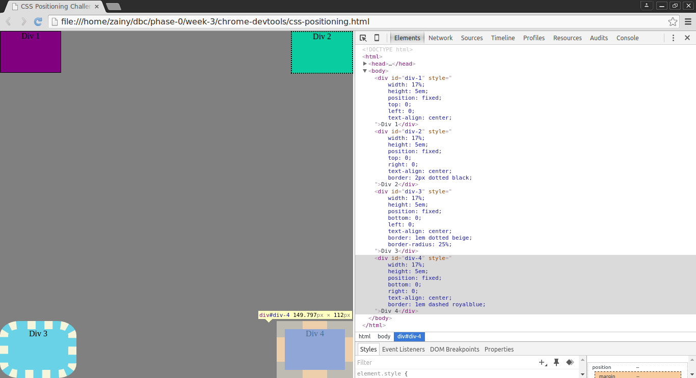

**How can you use Chrome's DevTools inspector to help you format or position elements?**
  -it makes things very dynamic giving you a live preview as you work, highlights what elements affect what, and even gives an auto-complete

**How can you resize elements on the DOM using CSS?**
  -

**What are the differences between absolute, fixed, static, and relative positioning? Which did you find easiest to use? Which was most difficult?**
  -static is the default position and is placed according to the flow of the page. relative is positioned relative to the default position. fixed makes an element stays in place wherever it's positioned even if the page is scrolled. absolute is positioned relative to the nearest positioned ancestor unless there isn't one, in which an absolute positioned element will move with scrolling. the easiest to use was fixed. the hardest to use was absolute.

**What are the differences between margin, border, and padding?**
  -the padding is the area around your content. the border is around the padding. the margin is the outer area.

**What was your impression of this challenge overall? (love, hate, and why?)**
  -it was alright. i've found i'm not a super big fan of css positioning but the devtools was pretty cool and helped me understand a couple other things better.